# Mermaid Chart Examples

ADR-specific diagram patterns followed by general mermaid syntax reference.

## ADR Status Transitions

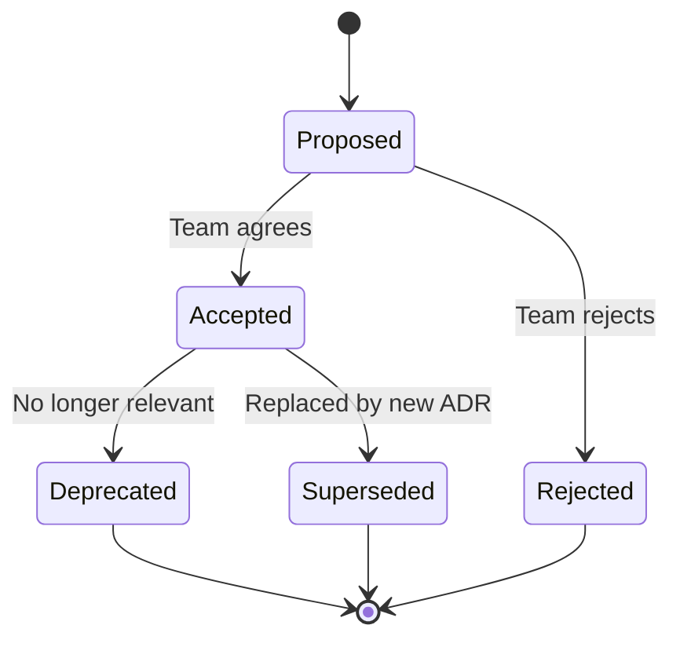

## ADR Decision Process

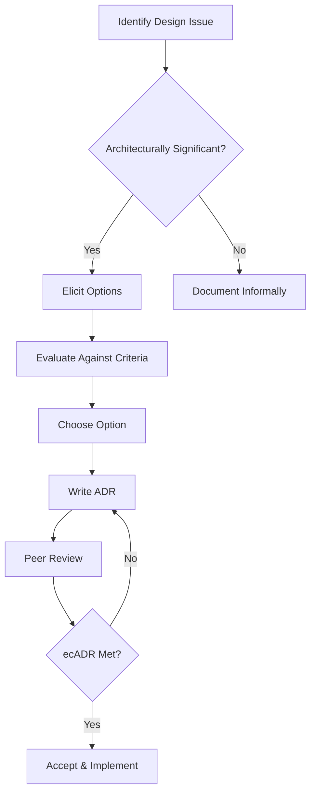

## ADR Relationship Graph

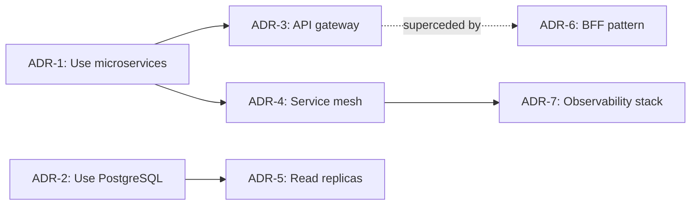

## ADR Lifecycle (Sequence)

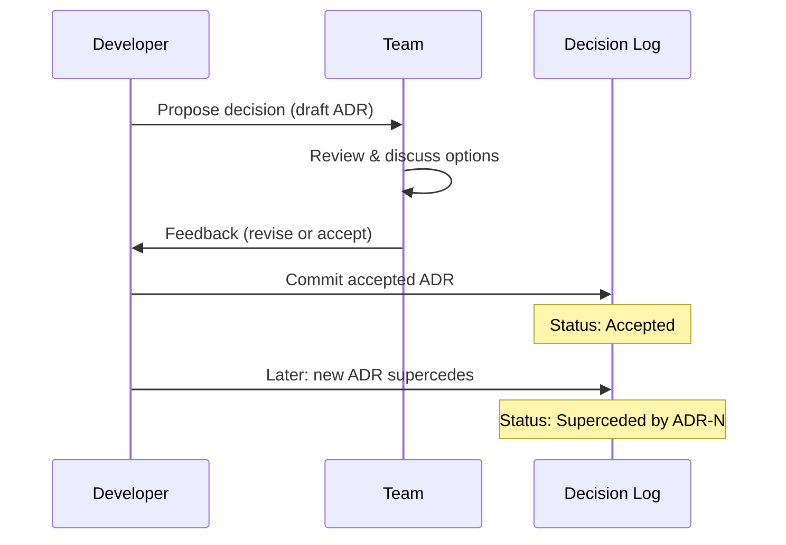

## Comparison Table (Preferred for Option Analysis)

When comparing options in an ADR, prefer markdown tables over diagrams:

| Criteria | Option A | Option B | Option C |
|----------|:--------:|:--------:|:--------:|
| Latency  | ✅ Low   | ⚠️ Med   | ❌ High  |
| Cost     | ❌ High  | ✅ Low   | ✅ Low   |
| Maturity | ✅ Proven| ⚠️ New   | ✅ Proven|
| Fit      | ✅       | ✅       | ⚠️       |

---

## General Mermaid Syntax Reference

## Basic Pie Chart

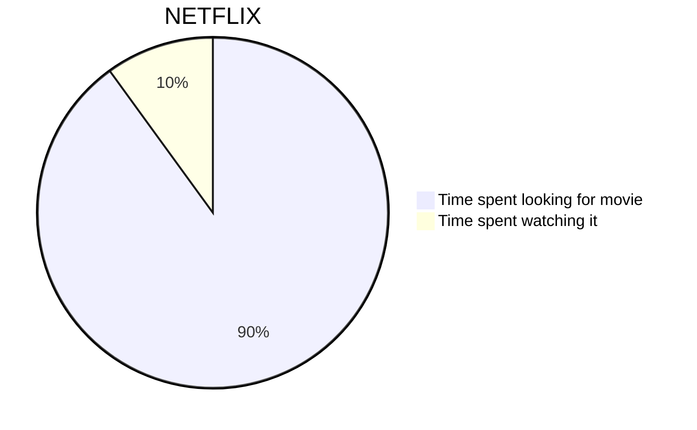

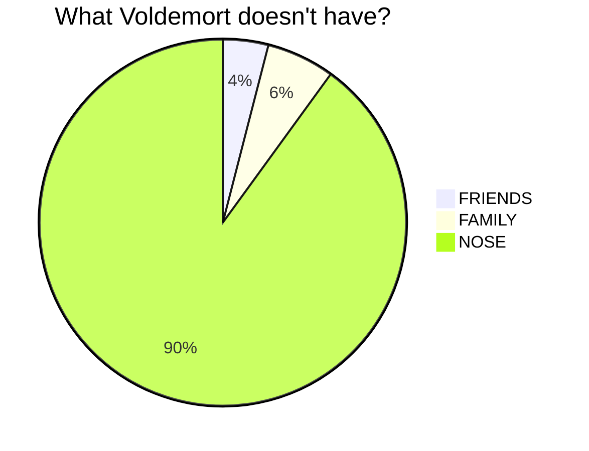

## Basic sequence diagram

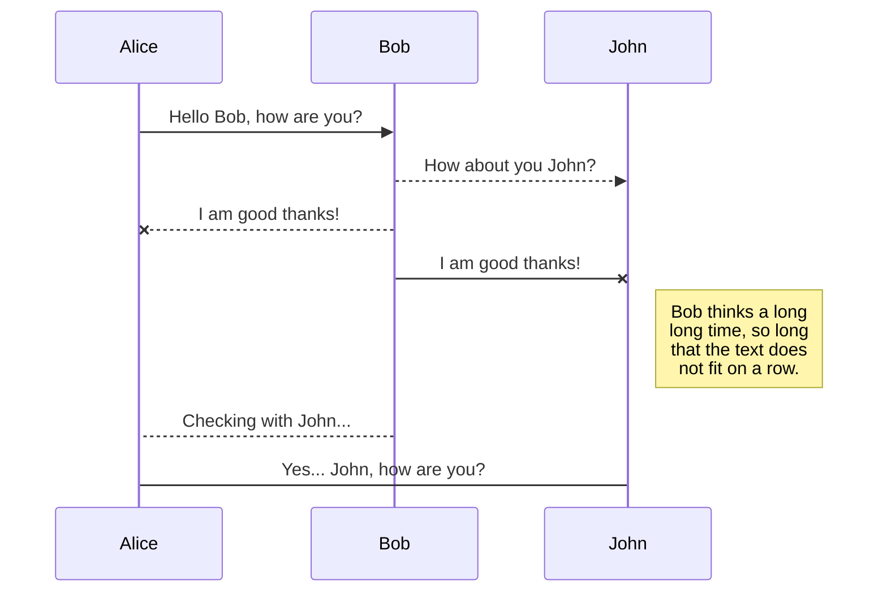

## Basic flowchart

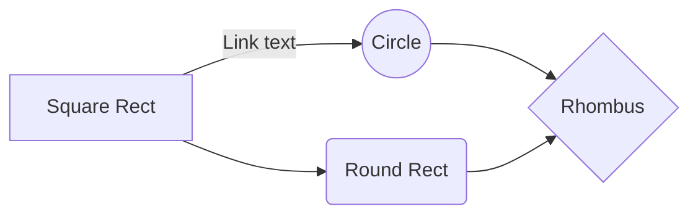

## Larger flowchart with some styling

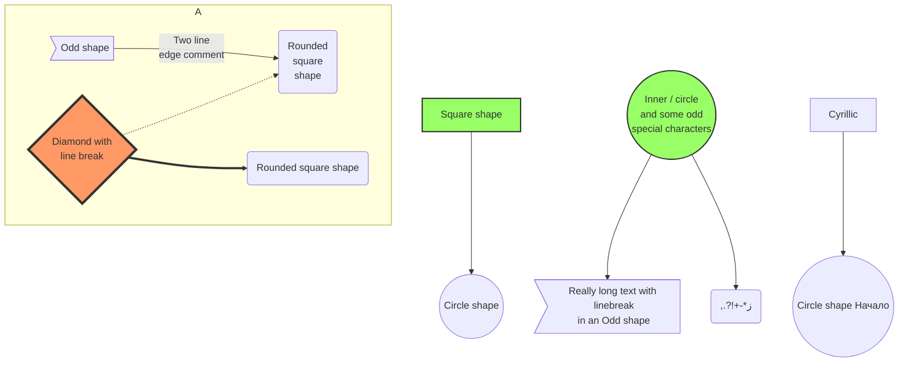

## SequenceDiagram: Loops, alt and opt

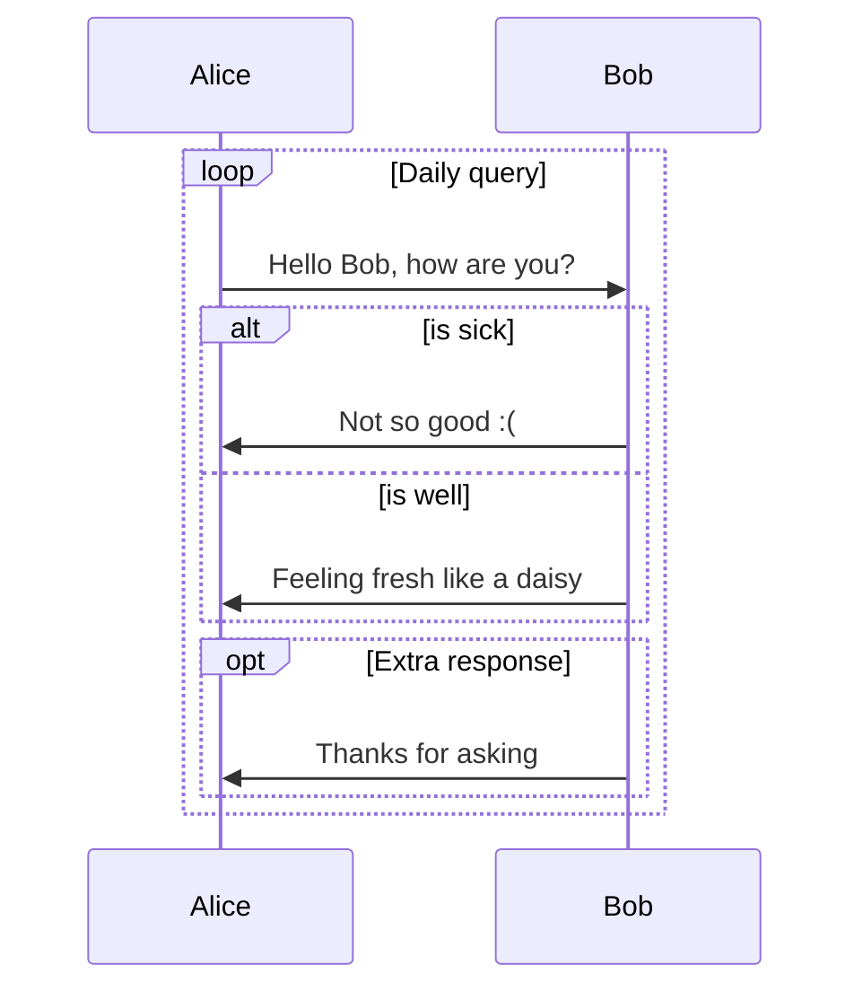

## SequenceDiagram: Message to self in loop

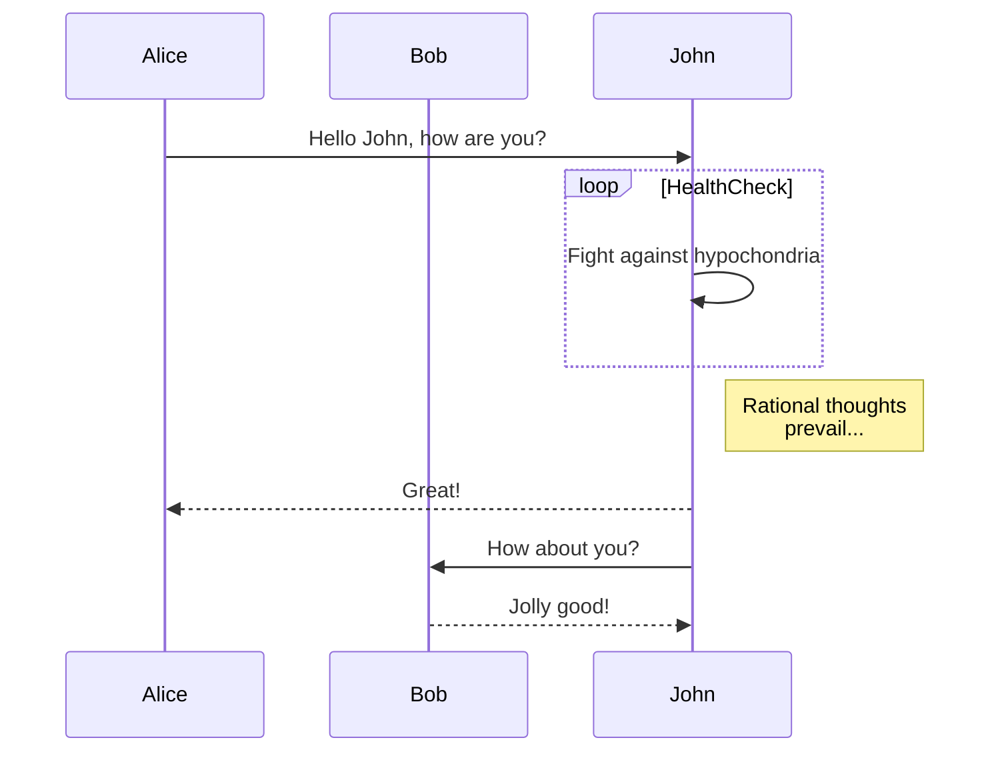

## Sequence Diagram: Blogging app service communication

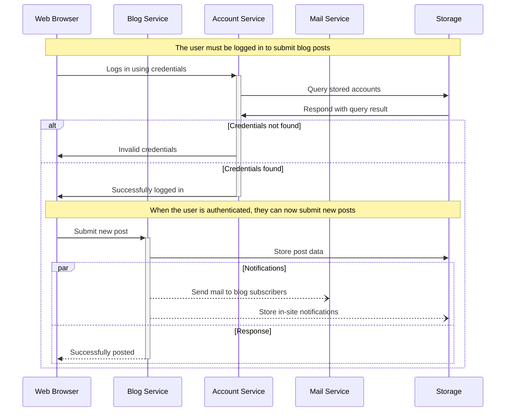

## A commit flow diagram.

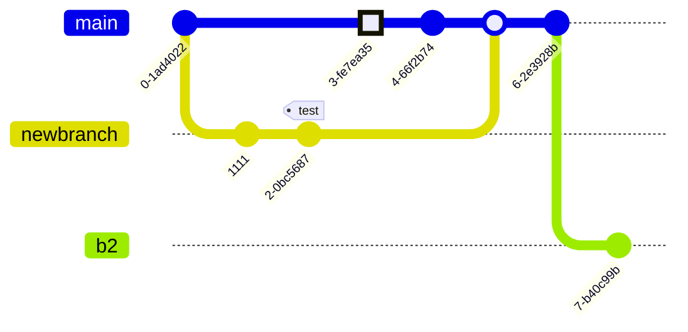

<!--- cspell:ignore Ashish newbranch --->