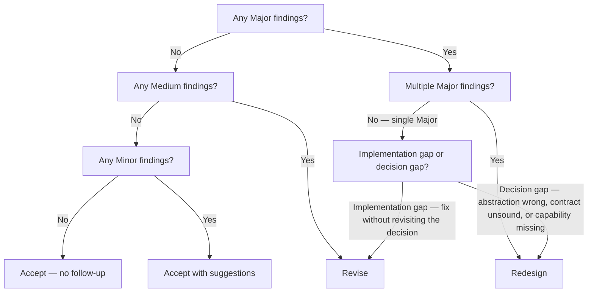

# DX Review

Evaluates whether developer-facing elements are pragmatic, discoverable, consistent, and maintainable.

**If a step is skipped, log the justification inline before proceeding.** Skipping without justification is a workflow violation.

---

## Inputs

| Field | Required | Description |
|-------|----------|-------------|
| `artifact` | Yes | The artifact to review. Accepted types: source code file, plan.md, API definition, build script, Makefile, CI/CD pipeline file, dependency manifest |
| `scope` | No | Override for Step 1b scope classification. One of: `New`, `Modified`, `Extended`, `Replaced`. If omitted, the reviewer infers scope from the artifact; defaults to `New` if scope cannot be determined |

If the artifact does not match any listed type, classify it as the nearest type from Step 1a and log the approximation. If no type can be approximated, return verdict **Redesign** with finding: `Artifact type unrecognized — review cannot proceed`.

---

## Policies

**Ignoring any of the below policies is a runtime violation, especially in agent-to-agent dispatch where no human is present to catch deviations.**

| ID | Policy |
|----|--------|
| P-1 | Precision — use brief, precise language in all feedback and justifications |
| P-2 | Scope-severity alignment — change scope determines the severity ceiling for findings |

### P-1: Precision

Feedback must be specific and actionable. Avoid hedging phrases ("might want to consider"). Every finding names the element, states the problem, and states what a fix looks like.

### P-2: Scope-Severity Alignment

The scope of the change (Step 1b) constrains finding severity. Apply the ceiling at Step 3a.

| Change Scope | Severity Ceiling |
|-------------|-----------------|
| New | No ceiling |
| Modified | Medium |
| Extended | Medium |
| Replaced | No ceiling |

When multiple elements have different change scopes, apply the P-2 ceiling per element independently — the ceiling for one element does not constrain findings on another.

**Pre-existing structural gap exception:** If a scoped change reveals a gap that predates the change (e.g., a missing error variant), classify at its own severity and set Provenance to `Pre-existing`.

---

## Procedure

| ID | Description |
|----|-------------|
| Inputs | Artifact and optional scope supplied by caller |
| Step 1 | Identify elements |
| Step 1a | Classify each element by type |
| Step 1b | Classify the change scope |
| Step 2 | Review each element against criteria |
| Step 2a | Pragmatism |
| Step 2b | Discoverability |
| Step 2c | Consistency |
| Step 2d | Error surface |
| Step 2e | Testability |
| Step 2f | Maintainability |
| Step 2g | Realistic setup |
| Step 2h | Automation |
| Step 3 | Classify findings by severity |
| Step 3a | Apply P-2 scope ceiling |
| Step 4 | Deliver verdict |
| Appendix A | Output format |

```
Step 1 — identify elements and classify
  ↓
Step 2 — review each element against criteria (2a–2h)
  ↓
Step 3 — classify findings by severity + apply P-2 ceiling (Step 3a)
  ↓
Step 4 — deliver verdict
```

---

## Step 1: Identify Elements

Enumerate all developer-facing elements in scope.

### Step 1a: Classify Element Type

Classify each element:

| Type | Description |
|------|-------------|
| Type abstraction | Interfaces, traits, structs, classes, enums, type aliases |
| API | Public or private function signatures, method surfaces, RPC/HTTP endpoints |
| Build procedure | Compile steps, CI/CD pipelines, Makefile targets, scripts, test runners |
| Dependency | External crates, packages, or services introduced or modified |

A single change may produce multiple elements. List each one separately. For multi-file artifacts, include the source file path in the element name (e.g., `src/api.rs::fetch_user`). Apply scope classification per element based on its own diff status.

### Step 1b: Classify Change Scope

| Scope | Description |
|-------|-------------|
| New | Element did not exist before |
| Modified | Changes to an existing element |
| Extended | Additions to an existing element |
| Replaced | Existing element is being replaced |

If a change includes both modifications to existing content and additions of new content, classify as **Modified** (stricter ceiling). Classify as **Extended** only when existing content is unchanged and the change is purely additive.

If the caller supplied a `scope` value in Inputs, use it as the default for all elements. Override the default with inferred scope when the artifact provides per-element evidence (e.g., diff markers). If the scope cannot be determined from available context, default to **New** (no ceiling applied).

---

## Step 2: Review Elements Against Criteria

Each element can be evaluated in parallel with agent tool.

For each element identified in Step 1, evaluate against criteria Step 2a–2h. Record findings using this format:

| ID | Criterion | Element | Finding | Severity | Provenance |
|----|-----------|---------|---------|----------|------------|
| F-01 | Step 2a | [element name] | [description] | Minor/Medium/Major | Current / Pre-existing |

Every criterion must have an entry for every element — use "N/A — [reason]" if a criterion does not apply.

Not all criteria apply equally to all element types. A `—` entry means the criterion is always N/A for that element type — log it as `N/A — not applicable to [type]` in the findings table.

| Criterion | Type abstraction | API | Build procedure | Dependency |
|-----------|:---:|:---:|:---:|:---:|
| 2a Pragmatism | ✓ | ✓ | ✓ | ✓ |
| 2b Discoverability | ✓ | ✓ | — | — |
| 2c Consistency | ✓ | ✓ | ✓ | — |
| 2d Error surface | ✓ | ✓ | — | — |
| 2e Testability | ✓ | ✓ | ✓ | — |
| 2f Maintainability | ✓ | ✓ | ✓ | ✓ |
| 2g Realistic setup | — | — | ✓ | ✓ |
| 2h Automation | — | — | ✓ | — |

### Step 2a: Pragmatism

- Does this element solve a problem that does not yet exist? (over-engineering)
- Does this element fail to solve a problem that will predictably exist? (under-engineering)

*Look for:* abstractions with a single implementation and no anticipated second use case; the same pattern recurring three or more times without encapsulation.

### Step 2b: Discoverability

- Is the element findable and self-documenting from its interface?

*Look for:* APIs whose correct usage requires reading the implementation.

### Step 2c: Consistency

- Do the naming conventions, error handling patterns, and abstraction boundaries match the surrounding codebase?

*Look for:* error types that differ in structure from the project's established error handling pattern.

If the surrounding codebase is not available, evaluate internal consistency within the artifact. Log each entry as `Partial — no codebase context provided`.

### Step 2d: Error Surface

- Are all failure modes represented in the return type and recoverable?

*Look for:* functions that panic where a `Result` would be appropriate.

### Step 2e: Testability

- Can this element be tested in isolation without introducing test friction?

*Look for:* concrete dependencies injected directly where a trait or interface would allow mocking.

### Step 2f: Maintainability

- What is the blast radius of a future change to this element?

*Look for:* high fan-in — many callers that would all need updating on a signature change.

If caller context is not available, evaluate blast radius based on surface area (parameter count, return type complexity). Log fan-in as `Cannot evaluate — caller context not available`.

### Step 2g: Realistic Setup

- Are all setup steps and environment requirements documented and reproducible?

*Look for:* required environment variables with no documented defaults or `.env.example`.

### Step 2h: Automation

- Does the toolchain catch errors at build time, not runtime?
- Does the implementation contain boilerplate that should be derived or code-generated?

*Look for:* repetitive structural patterns that could be derived but are written by hand. If the repetition was already flagged under 2a, log 2h as `N/A — covered by [finding ID] under Step 2a`.

---

## Step 3: Classify Findings

Assign a severity to each finding based on its blast radius — how broadly the issue affects the developer's ability to use, understand, or maintain the element.

| Severity | Blast radius | Examples |
|----------|--------------|----------|
| Minor | Local, cosmetic, or low-risk | Missing doc comment, inconsistent naming, a hand-written impl that could be derived |
| Medium | Interaction or integration surface | Changed error type without updating callers, test friction on a non-critical path, undocumented setup step for an optional feature |
| Major | Flow, model, or structural gap | Panic where Result is required, untestable abstraction on a critical path, undocumented required setup that breaks CI for new contributors, missing error variants for known failure modes |

### Step 3a: Apply P-2 Scope Ceiling

After initial classification, check each finding against the P-2 severity ceiling from Step 1b. If a finding exceeds the ceiling for its element's change scope, determine whether it is a pre-existing structural gap:

- **Yes — pre-existing gap:** Keep the severity. Set `Provenance` to `Pre-existing` in the findings table so it is not attributed to the current change.
- **No — introduced by this change:** Cap the severity at the ceiling. Log the rationale. Set `Provenance` to `Current`.
- **Cannot determine:** Default to treating the finding as introduced by this change (apply the ceiling). Log that provenance was indeterminate. Set `Provenance` to `Current`.

---

## Step 4: Deliver Verdict

Confirm all criteria (2a–2h) have entries for every element before selecting a verdict. Missing entries are a workflow violation.

Pre-existing findings (Provenance = `Pre-existing`) are reported in the findings table but excluded from the verdict decision tree. The verdict reflects only current-change findings.

Summarize findings and select a verdict using the decision tree below.



| Verdict | Condition | Follow-up |
|---------|-----------|-----------|
| Accept | No findings | None |
| Accept with suggestions | All findings are Minor | Return verdict and suggestions to caller. No additional DX pass required |
| Revise | One or more Medium findings without Major, OR a single Major that is an implementation gap | Return verdict and findings to caller. Do not re-invoke; the caller determines whether to schedule a follow-up review pass |
| Redesign | A single Major that is a decision gap, OR multiple Major findings | Return verdict and findings to caller; do not continue. The caller determines whether to escalate or halt its own pipeline |

**Implementation gap vs. decision gap:**

- An **implementation gap** can be resolved by adding or correcting what was built — a missing error variant, for example. The decision (what to build and why) remains sound.
- A **decision gap** reveals that the abstraction is wrong, the API contract is unsound, or the architecture requires a capability the current design cannot provide. The decision must be revisited before any implementation proceeds.
- Multiple Major findings of either type escalate to Redesign by default — the cumulative signal indicates a structural problem.

| Element Type | Implementation gap | Decision gap |
|---|---|---|
| Type abstraction | Missing error variant in an existing enum | Enum used where a trait is needed for polymorphism |
| API | Missing validation on one parameter | Signature forces caller to own internal state |
| Build procedure | Missing flag on a benchmark target | Pipeline cannot complete within resource limits |
| Dependency | Version pinned too loosely | Dependency pulled in for a utility the project should own |

---

## Appendix A: Output Format

Output format v1. A complete review contains these sections in order:

```
## Step 1: Elements

| Element | Type | Scope |
|---------|------|-------|
| [name or file::name] | [Type abstraction / API / Build procedure / Dependency] | [New / Modified / Extended / Replaced] |

## Step 2: [findings table, organized by element, all criteria covered]

| ID | Criterion | Element | Finding | Severity | Provenance |
|----|-----------|---------|---------|----------|------------|
| F-01 | Step 2a | [element name] | ... | Minor | Current |
| F-02 | Step 2b | [element name] | N/A — not applicable to [type] | — | — |
| ... | ... | ... | ... | ... | ... |

## Step 3: [severity summary after P-2 ceiling applied]

| Severity | Count | Finding IDs |
|----------|-------|-------------|
| Major | N | F-xx, ... |
| Medium | N | F-xx, ... |
| Minor | N | F-xx, ... |

## Step 4: [verdict with rationale]

Verdict: **[Accept | Accept with suggestions | Revise | Redesign]**
Next action: **[none | caller-reviews-suggestions | caller-schedules-follow-up | caller-escalates-or-halts]**
```

`next_action` values map to verdicts:

| Verdict | next_action |
|---------|-------------|
| Accept | `none` |
| Accept with suggestions | `caller-reviews-suggestions` |
| Revise | `caller-schedules-follow-up` |
| Redesign | `caller-escalates-or-halts` |