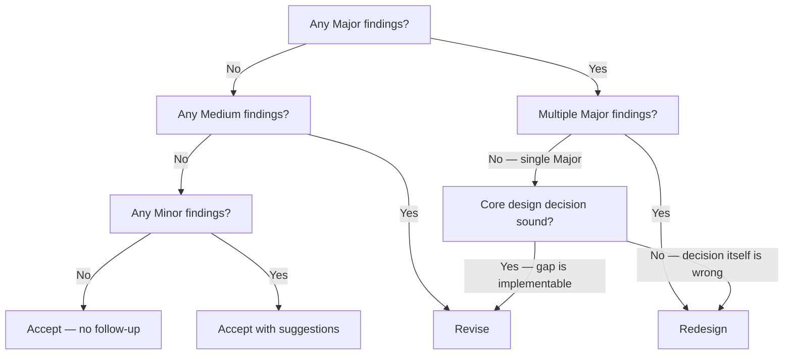

# UX Review

Reviews plans or code for user experience quality across CLI, UI, and guide interfaces.

**If a step is skipped, log the justification inline before proceeding.** Skipping without justification is a workflow violation.

---

## Inputs

The calling agent must supply the artifact under review. The reviewer infers interface types and scope from the artifact unless the caller provides them explicitly.

| Field | Required | Description |
|-------|----------|-------------|
| `artifact` | Yes | The artifact to review. Accepted types: source code file, plan.md, CLI `--help` or command output, UI component file, guide document |
| `scope` | No | Override for Step 1b scope classification. One of: `New`, `Modified`, `Extended`, `Replaced`. If omitted, the reviewer infers scope from the artifact; defaults to `New` if scope cannot be determined |

---

## Policies

**Ignoring any of the below policies is a runtime violation, especially in agent-to-agent dispatch where no human is present to catch deviations.**

| ID | Policy |
|----|--------|
| P-1 | Spacing rule of 8 — all spacing values use multiples of 8px |
| P-2 | Platform conventions — follow established UX conventions for the interface type |
| P-3 | Scope-severity alignment — change scope determines the severity ceiling for findings |

### P-1: Rule of 8

All spacing values (padding, widths, margins) use multiples of 8: 8px, 16px, 24px, 32px.

**Applies to UI interfaces only.** For CLI interfaces, skip P-1 — there are no pixel-based spacing values to evaluate.

### P-2: Platform Conventions

Follow established UX conventions for the target interface type (CLI, web UI, mobile). Standard interaction patterns over novel ones.

### P-3: Scope-Severity Alignment

The scope of the change (Step 1b) constrains finding severity. Apply the ceiling at Step 3.

| Change Scope | Severity Ceiling |
|-------------|-----------------|
| New | No ceiling |
| Modified | Medium |
| Extended | Medium |
| Replaced | No ceiling |

When multiple interfaces have different change scopes, apply the P-3 ceiling per interface independently — the ceiling for one interface does not constrain findings on another.

**Pre-existing structural gap exception:** If a scoped change reveals a gap that existed before this change — missing state coverage, a broken escape hatch, a wrong mental model baked into the original design — that gap is classified at its own severity regardless of the scope ceiling. Log the gap as a pre-existing finding and annotate it so it is not attributed to the current change.

---

## Procedure

| ID | Description |
|----|-------------|
| Inputs | Artifact and optional scope supplied by caller |
| Step 1 | Identify audience and interfaces |
| Step 1a | Classify each interface by type |
| Step 1b | Classify the change scope |
| Step 2 | Review user flows against criteria |
| Step 2a | Visual clarity |
| Step 2b | Escape hatches |
| Step 2c | Self-help |
| Step 2d | Shortcuts and preferences |
| Step 2e | Completeness |
| Step 2f | Usability |
| Step 3 | Classify findings by severity |
| Step 3a | Apply P-3 scope ceiling |
| Step 4 | Deliver verdict |
| Appendix A | Output format |

```
Step 1 — identify audience and interfaces
  ↓
Step 2 — review user flows against criteria (2a–2f, all mandatory)
  ↓
Step 3 — classify findings by severity + apply P-3 ceiling (Step 3a)
  ↓
Step 4 — deliver verdict
```

---

## Step 1: Identify Audience and Interfaces

Determine the target user audience. Enumerate all user-facing interfaces in scope.

### Step 1a: Classify Interface Type

Classify each interface:

| Type | Description |
|------|-------------|
| CLI | Commands, flags, output formatting |
| UI | Visual components, forms, controls, layouts |
| Guide | Step-by-step user instructions (guides tell how to use something; documentation explains why — a documentation page may contain a guide as a component, in which case classify at the component level: the embedded guide is reviewed as Guide, the surrounding documentation prose is out of scope) |

### Step 1b: Classify Change Scope

Determine what kind of change applies to each interface. This feeds P-3 (scope-severity alignment).

| Scope | Description |
|-------|-------------|
| New | Interface did not exist before |
| Modified | Changes to an existing interface |
| Extended | Additions to an existing interface |
| Replaced | Existing interface is being replaced |

If the caller supplied a `scope` value in Inputs, use it directly. If the scope cannot be determined from available context, default to **New** (no ceiling applied).

---

## Step 2: Review User Flows

Each interface can be reviewed in parallel with agent tool.

For each interface identified in Step 1, evaluate against criteria Step 2a–2f. When multiple interfaces are in scope, complete all criteria for one interface before moving to the next. Organize findings by interface.

Record findings using this format:

| ID | Criterion | Interface | Finding | Severity | Provenance |
|----|-----------|-----------|---------|----------|------------|
| F-01 | Step 2a | [interface name] | [description] | Minor/Medium/Major | Current / Pre-existing |

Every criterion must have an entry per interface — use "N/A — [reason]" if a criterion does not apply.

### Step 2a: Visual Clarity

- Can the user understand how information is organized?
- Can a low-vision user differentiate the controls? (Contrast check)

*Look for:* unlabeled groupings, controls that rely on color alone to convey state, text that lacks sufficient contrast against its background.

**CLI contrast:** Check that ANSI color output is not the sole indicator of state. Output that loses meaning when color is stripped (e.g., plain text mode, screen readers) is a finding.

### Step 2b: Escape Hatches

- Does the interface communicate why an action cannot be performed?

*Look for:* disabled controls with no tooltip or explanation, error states that identify what went wrong but not how to resolve it, actions that silently do nothing.

### Step 2c: Self-Help

- Is there guidance in discoverable locations for the user to understand how to use the interface?

*Look for:* flows that require prior knowledge not surfaced in the interface, missing inline hints on complex inputs, help content hidden behind non-obvious affordances.

### Step 2d: Shortcuts and Preferences

- Can the user skip or auto-fill steps they repeat often?

*Look for:* repeated multi-step flows with no shortcut, forms that cannot be pre-filled or templated, settings that reset between sessions unexpectedly.

### Step 2e: Completeness

- Does the interface cover all parts of the system it exposes?

*Look for:* system states with no corresponding UI representation, actions available in the system that cannot be reached through this interface, partial workflows with no continuation path.

### Step 2f: Usability

- Can the user accomplish their goal with this interface?
- Can they explain to someone else how to use it?

*Look for:* flows where the critical path requires more than 3 steps without feedback, terminology mismatches between the UI and the user's mental model, interfaces that work correctly but cannot be taught.

---

## Step 3: Classify Findings

Assign a severity to each finding from Step 2 based on its blast radius (how broadly the issue affects the user's ability to understand or use the interface).

| Severity | Blast Radius | Examples |
|----------|--------------|----------|
| Minor | Cosmetic or documentation-only | Label copy, spacing correction, adding a help tooltip, swapping a control widget |
| Medium | Interaction or data surface change | New form field, changed validation, altered feedback copy, performance-visible latency |
| Major | Flow, model, or structural gap | Missing state coverage, broken escape hatch, wrong mental model exposed, new commands or gestures without discoverability path |

### Step 3a: Apply P-3 Scope Ceiling

After initial classification, check each finding against the P-3 severity ceiling from Step 1b. If a finding exceeds the ceiling for its interface's change scope, determine whether it is a pre-existing structural gap:

- **Yes — pre-existing gap:** Keep the severity. Annotate the finding as pre-existing so it is not attributed to the current change.
- **No — introduced by this change:** Cap the severity at the ceiling. Log the rationale.
- **Cannot determine:** Default to treating the finding as introduced by this change (apply the ceiling). Log that provenance was indeterminate.

---

## Step 4: Deliver Verdict

Before selecting a verdict, confirm that every criterion from Step 2a–2f has an inline entry per interface. Missing entries are a workflow violation — resolve before proceeding.

Summarize findings. Select a verdict using the decision tree below.



| Verdict | Condition | Follow-up |
|---------|-----------|-----------|
| Accept | No findings | None |
| Accept with suggestions | All findings are Minor | Log suggestions in review output; no additional UX pass required |
| Revise | Medium findings without Major, OR a single Major where the core decision is sound and the gap is implementable | Return verdict and findings to caller. Do not re-invoke; the caller determines whether to schedule a follow-up review pass |
| Redesign | Major finding that challenges the design decision itself, OR multiple Major findings | Return verdict and findings to caller; do not continue. The caller determines whether to escalate or halt its own pipeline |

**Evaluating "Core design decision sound?"** A design decision is sound if all three hold:

1. The interface targets the correct user type for the task being exposed.
2. The interaction model matches the user's established mental model for this interface type (CLI, UI, or Guide).
3. The data model or information architecture supports the user's task without requiring the user to understand internal system structure.

If any criterion fails, the decision is unsound → Redesign. If all three hold and the Major finding is a gap in execution (missing state, missing path, undiscoverable feature), the decision is sound → Revise.

---

## Appendix A: Output Format

Output format v1. A complete review contains these sections in order:

```
## Step 1: [audience, interfaces classified by type and scope]

## Step 2: [findings table, organized by interface, all criteria covered]

| ID | Criterion | Interface | Finding | Severity | Provenance |
|----|-----------|-----------|---------|----------|------------|
| F-01 | Step 2a | CLI | ... | Minor | Current |
| ... | ... | ... | ... | ... | ... |

## Step 3: [severity summary after P-3 ceiling applied]

| Severity | Count | Finding IDs |
|----------|-------|-------------|
| Major | N | F-xx, ... |
| Medium | N | F-xx, ... |
| Minor | N | F-xx, ... |

## Step 4: [verdict with rationale]

Verdict: **[Accept | Accept with suggestions | Revise | Redesign]**
Next action: **[none | caller-schedules-follow-up | caller-escalates-or-halts]**
```

`next_action` values map to verdicts:

| Verdict | next_action |
|---------|-------------|
| Accept | `none` |
| Accept with suggestions | `none` |
| Revise | `caller-schedules-follow-up` |
| Redesign | `caller-escalates-or-halts` |