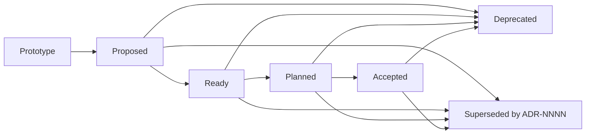
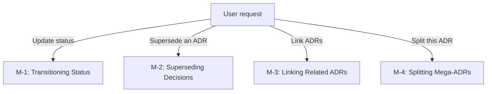

# Managing ADRs

Self-contained reference for ADR management tasks. Read this file when the user asks to update, supersede, deprecate, link, split, or generate a decision log for existing ADRs.

## Status Lifecycle

Every ADR has a status that tracks its progression:



| Status | Meaning | When to Use |
|--------|---------|-------------|
| **Prototype** | Decision is drafted to drive immediate prototyping | Initial state for local agent-developer workflow |
| **Proposed** | Decision is ready for team review | When submitting for PR-based review or stakeholder sign-off |
| **Ready** | Decision is reviewed and approved — ready for implementation | After review Accept verdict |
| **Planned** | Decision is decomposed into an implementation plan | When implement-adr generates a plan |
| **Accepted** | Decision is fully implemented | After successful plan execution by implement-adr |
| **Deprecated** | Decision is no longer relevant | When the problem it solved no longer exists |
| **Superseded** | Decision is replaced by a newer ADR | When a new decision explicitly replaces this one |

**Workflow note:** New ADRs start as `Prototype`. `Proposed` signals readiness for team review (e.g., before opening a PR). ADRs can skip `Ready` and move directly from `Prototype` to `Planned` if the author bypasses team review via `implement-adr`.

## Procedure

| ID | Description |
|----|-------------|
| M-1 | Transitioning Status — update an ADR's status with guards and timestamp |
| M-2 | Superseding Decisions — replace an existing ADR with a newer one |
| M-2a | When to Supersede vs. Amend — decision criteria |
| M-2b | Superseding Workflow — step-by-step process |
| M-3 | Linking Related ADRs — establish relationships between decisions |
| M-3a | Relationship Types — the kinds of links between ADRs |
| M-3b | Linking with the Makefile (Nygard format only) — tooling-assisted linking |
| M-3c | Best Practices for Linking — when and how to link |
| M-4 | Splitting Mega-ADRs — decompose oversized decisions |
| M-4a | Signs of a Mega-ADR — detection criteria |
| M-4b | Splitting Process — step-by-step decomposition |



---

## M-1: Transitioning Status

Use the Makefile `status` target:

```bash
make -f <skill-root>/Makefile status NUM=<adr-number> STATUS=<new-status>
```

**Examples:**
```bash
make -f <skill-root>/Makefile status NUM=5 STATUS=Proposed
make -f <skill-root>/Makefile status NUM=3 STATUS=Deprecated
```

**Rules:**
- Only transition one status at a time per ADR.
- Record the reason for status changes in the ADR's context or as a brief note below the status line when the change is non-obvious.
- The `Ready` status is set by `author-adr` after a review Accept verdict. It signals the decision is reviewed and approved but not yet implemented. Only `Proposed` ADRs transition to `Ready`.
- The `Accepted` status is set by the `implement-adr` skill after successful plan execution — `author-adr` does not transition ADRs to `Accepted`.
- The `Planned` status is used by the `implement-adr` skill when an ADR has been decomposed into a plan but not yet fully implemented. `Prototype`, `Proposed`, and `Ready` ADRs can transition to `Planned`.

## M-2: Superseding Decisions

### M-2a: When to Supersede vs. Amend

| Situation | Action |
|-----------|--------|
| The core decision changes (different option chosen) | **Supersede** — create a new ADR |
| Context has shifted enough that the rationale no longer applies | **Supersede** — create a new ADR |
| Minor clarification or typo fix | **Amend** — edit the existing ADR in place |
| Adding detail that doesn't change the decision | **Amend** — edit the existing ADR in place |
| Extending scope beyond the original decision | **Supersede** — the new scope is a new decision |

### M-2b: Superseding Workflow

1. Create the new ADR with the `SUPERSEDE` parameter:

   ```bash
   make -f <skill-root>/Makefile new TITLE="Use OAuth2 instead of API keys" SUPERSEDE=3
   ```

   This automatically:
   - Creates the new ADR with a link to the superseded ADR
   - Updates the old ADR's status to `Superseded by ADR-NNNN`

2. In the new ADR's Context section, explain why the previous decision is being replaced. Reference the old ADR by number.

3. The new ADR starts in `Proposed` status — it still needs to go through its own acceptance process.

## M-3: Linking Related ADRs

Links express relationships between ADRs that don't involve replacement.

### M-3a: Relationship Types

| Relationship | When to Use | Example |
|-------------|-------------|---------|
| **Supersedes / Superseded by** | New decision replaces old | ADR-5 supersedes ADR-3 |
| **Amends / Amended by** | Extends or clarifies | ADR-7 amends ADR-5 |
| **Depends on** | Can't implement without the other | ADR-4 depends on ADR-2 |
| **Related to** | Decisions in the same problem space | ADR-6 related to ADR-4 |
| **Constrains / Constrained by** | Limits options for another | ADR-3 constrains ADR-8 |

### M-3b: Linking with the Makefile (Nygard format only)

```bash
make -f <skill-root>/Makefile link SOURCE=5 LINK="amends" TARGET=3 REVERSE="amended by"
```

For MADR format, add links manually by editing the ADR files directly.

### M-3c: Best Practices for Linking

- Link bidirectionally — if ADR-5 amends ADR-3, both should mention the link.
- Keep link text concise — use the relationship type as the link label.
- Don't over-link — only express relationships that aid navigation or understanding. Not every ADR in the same domain needs to link to every other.

## M-4: Splitting Mega-ADRs

A Mega-ADR bundles too many decisions into one document.

### M-4a: Signs of a Mega-ADR

- The Decision section describes more than one distinct choice
- The Consequences section has items that only relate to some of the decisions
- Different stakeholders care about different parts of the ADR
- The ADR is longer than ~2 pages (rough guideline)
- Alternatives are only compared for some decisions but not others

### M-4b: Splitting Process

1. Identify the distinct decisions within the Mega-ADR.
2. Create a new ADR for each distinct decision using `make new`.
3. Each new ADR should:
   - Reference the original Mega-ADR in its Context
   - Carry over only the relevant alternatives and consequences
   - Be self-contained — readable without the original
4. Mark the original Mega-ADR as `Superseded by ADR-N, ADR-M, ...`
5. Link the new ADRs to each other with `Related to` relationships.

## Guardrails

When managing ADRs, follow these rules:

1. **Never modify other ADRs without explicit instruction.** Cross-references and status updates to other ADRs (e.g., marking one as superseded) are the user's responsibility. Suggest the change but do not apply it unilaterally.

2. **One ADR, one decision.** If the user's request implies multiple decisions, recommend splitting into separate ADRs.

3. **Preserve history.** Do not delete ADRs. Use `Deprecated` or `Superseded` status instead. The decision log is an append-only record.

4. **Status changes are intentional.** Don't change status as a side effect of other edits. Status transitions should be explicit actions.

5. **Numbering is sequential.** New ADRs always get the next available number. Never reuse numbers from deprecated or superseded ADRs.

## Generating the Decision Log

The decision log is a table-of-contents view of all ADRs in the project. Generate it with:

```bash
make -f <skill-root>/Makefile generate
```

This produces a table of contents listing all ADRs with their numbers, titles, and statuses. Use the `PREFIX` parameter to add a URL prefix for links:

```bash
make -f <skill-root>/Makefile generate PREFIX="https://github.com/org/repo/blob/main/"
```

The decision log is useful for:
- Onboarding new team members to past decisions
- Auditing the decision history during reviews
- Identifying gaps in architectural coverage
