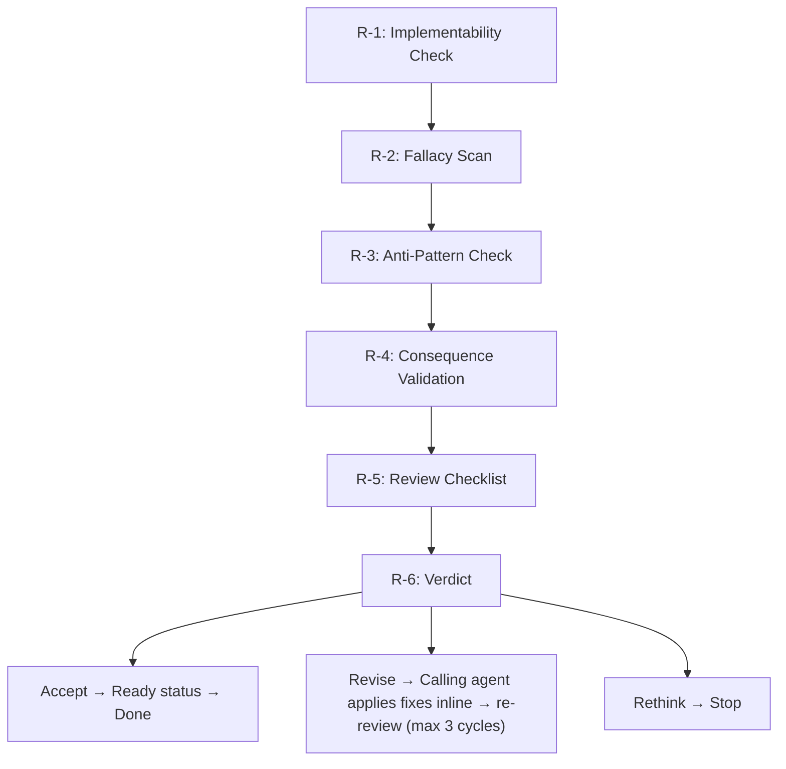

# Polishing an ADR

Self-contained reference for the ADR quality loop: review → verdict → revise → re-review. Read this file when the user asks to review, revise, or polish an ADR.

Use this as the prompt for the configured review agent (per ADR-0031, `[author.dispatch]`). The review agent executes steps R-1 through R-6. The calling agent handles revision inline. Custom agents get the same checks — their persona shapes judgment, not task structure.

**All steps must be executed in order within each phase. If a step is skipped, log the justification inline before proceeding.** Skipping without justification is a workflow violation.

---

## Policies

**Ignoring any of the below policies is a runtime violation ESPECIALLY when the user is away and operating autonomously**

| ID | Policy |
|----|--------|
| P-1 | Status cap — author-adr caps at Ready after review Accept verdict |
| P-2 | Dispatch compliance — use configured agents per `[author.dispatch]` |
| P-3 | Semantic boundary — never modify content above the `---` separator during revision |
| P-4 | Preserve existing addendum entries — do not modify or remove prior round Q&A entries |

### P-1: Status Cap at Ready

After a review Accept verdict, transition the ADR from `Proposed` to `Ready`. The author-adr skill never sets `Planned` or `Accepted` — those statuses belong to implement-adr.

### P-2: Dispatch Compliance

When `[author.dispatch]` is configured, use the configured agent for the review phase. Do not substitute `general-purpose` or skip dispatch.

### P-3: Semantic Boundary

The `---` separator above `## Comments` divides the immutable decision record (above) from the mutable revision worksheet (below). When appending Q&A entries during revision, never modify content above the separator.

### P-4: Preserve Existing Addendum Entries

In multi-round revisions, existing Q&A entries from prior rounds must not be modified or removed. New entries are appended below existing ones.

---

## Review Perspectives

Apply three perspectives progressively:

1. **Friendly peer/coach** — early feedback for improvement
2. **Official stakeholder** — adequacy confirmation and agreement
3. **Formal design authority** — approval and enforcement

> Prioritize comments by urgency (H/M/L), provide concrete
> finding-recommendation pairs, and lead with questions rather than demands.

---

## Procedure

| ID | Description |
|----|-------------|
| R-1 | Implementability Check — verify 6 criteria that predict planning success |
| R-1a | Checkpoint State Review — evaluate Evaluation/Conclusion checkpoint assessments |
| R-1b | Experimentation Tolerance Spectrum — assess data support level |
| R-2 | Fallacy Scan — check justification against 7 decision-making fallacies |
| R-3 | Anti-Pattern Check — scan for 11 ADR creation anti-patterns |
| R-4 | Consequence Validation — review stated consequences for plausibility |
| R-5 | Review Checklist — answer 7 questions about the ADR |
| R-6 | Verdict — Accept, Revise, or Rethink |



**Conditional steps:** R-1a is conditional on the ADR using the checkpoint template format.

---

## Review Phase

The review agent executes steps R-1 through R-6. This phase produces a structured review with a verdict.

### R-1: Implementability Check

Verify 6 criteria that predict whether `implement-adr` can successfully plan from this ADR:

| # | Criterion | What to Check |
|---|-----------|---------------|
| 1 | **Criteria** | Are ≥2 genuine alternatives identified and compared? |
| 2 | **Documentation** | Is the decision captured in the template and shared? |
| 3 | **Experimentation Tolerance** | Does this decision need more data to support it, or would it benefit from prototyping? Assess on the spectrum below. Flag only when the ADR appears to need data it doesn't have and isn't framed as experimental. |
| 4 | **Scope Clarity** | Are the boundaries of what's in and out of scope clear enough to decompose into tasks? Can the agent identify what files, components, or interfaces are affected? |
| 5 | **Actionable Consequences** | Can test/acceptance criteria be derived from the stated consequences? Are consequences specific enough to verify, or are they vague aspirations? |
| 6 | **Dependency Visibility** | Are links to related ADRs, external systems, or prerequisites explicit? Would `implement-adr` discover missing dependencies during planning? |

Report which criteria are met and which are missing.

#### R-1a: Checkpoint State Review (Conditional)

**Condition:** The ADR uses the checkpoint template format.

Review the state of each checkpoint:

- **Evaluation Checkpoint** — check whether the assessment was `Proceed`, `Pause for validation`, or `Skipped`. If `Skipped`, evaluate whether the rationale is sound. If the checkpoint is **blank** (no assessment written), flag this as a finding — it means the checkpoint was ignored, not consciously skipped.
- **Conclusion Checkpoint** — check whether the assessment was `Ready for review`, `Needs work`, or `Skipped`. A blank conclusion checkpoint suggests the ADR was not self-checked before requesting review.
- **Validation needs** — if populated, check whether the listed experiments were actually run and findings incorporated. If validation needs are listed but not addressed, flag as a gap.

Note: ADRs created before ADR-0024 will not have checkpoint sections. This is expected and not a finding.

#### R-1b: Experimentation Tolerance Spectrum

Rather than a binary pass/fail, assess on a three-point spectrum:

- **Well-supported** — data, PoC, or prior experience backs the decision. No concern.
- **Needs validation** — the decision makes claims that could be tested but aren't. Recommend a prototype or spike before implementation.
- **Deliberately experimental** — the decision explicitly acknowledges uncertainty and is designed to learn. Acceptable if the ADR frames it honestly (not a Fairy Tale anti-pattern).

The key insight: "flying blind" is fine when *intentional* and *acknowledged*. It's a problem when the ADR presents unvalidated claims as fact.

### R-2: Fallacy Scan

Check the ADR's justification against the seven architectural decision-making fallacies. Flag any that apply:

| # | Fallacy | What to Look For |
|---|---------|------------------|
| 1 | **Blind flight** | Missing context, no NFRs, no measurable quality goals |
| 2 | **Following the crowd** | "Industry standard," "everyone uses it," popularity as justification |
| 3 | **Anecdotal evidence** | Single project success/failure story as entire rationale |
| 4 | **Blending whole and part** | Rejecting an entire style because one element doesn't fit |
| 5 | **Abstraction aversion** | Comparing concepts with products (REST vs. SOAP, style vs. framework) |
| 6 | **Golden hammer** | Only one option considered, or dismissing alternatives without evaluation |
| 7 | **Time irrelevance** | Using outdated benchmarks/evaluations without re-validation |
Also check for the **AI über-confidence** bonus fallacy: AI-generated justifications presented without QA or accountability.

For each detected fallacy, provide:
- The specific text that triggers the concern
- Which fallacy it matches
- A concrete countermeasure recommendation

### R-3: Anti-Pattern Check

Scan for the 11 ADR creation anti-patterns:

**Subjectivity:**
- **Fairy Tale** — shallow justification without real evidence
- **Sales Pitch** — marketing language instead of technical analysis
- **Free Lunch Coupon** — ignoring negative consequences
- **Dummy Alternative** — including obviously bad options to make the chosen one look good

**Time dimension:**
- **Sprint** — only one option evaluated
- **Tunnel Vision** — ignoring broader context
- **Maze** — topic and content don't match

**Size/nature:**
- **Blueprint/Policy in Disguise** — not actually a decision
- **Mega-ADR** — too many decisions bundled together

**Magic tricks:**
- **Pseudo-accuracy** — false quantitative scoring to disguise subjective judgment

### R-4: Consequence Validation

Review the Consequences section (Nygard format) or Pros/Cons sections (MADR format) to verify factual accuracy. AI-drafted ADRs are especially prone to plausible-sounding but unverified assertions.

For each stated consequence or pro/con:

1. **Present the assertion** — quote the specific consequence from the ADR.
2. **Assess plausibility** — flag speculative, unsubstantiated, or overly optimistic/pessimistic assertions. Look for quantitative claims without evidence, unqualified absolutes, or predictions stated as facts.
3. **Ask the user directly** — confirm whether the stated consequence matches their understanding of reality.
4. **Suggest revisions** — if inaccurate or unverified, propose revised wording that accurately reflects the level of certainty.

If the ADR has many consequences, group related ones — but never skip this step entirely.

**Autonomous mode:** The reviewer assesses plausibility on its own. Flag speculative assertions with `<!-- Unverified: [reason] -->`. The reviewer cannot confirm real-world accuracy — it can only flag assertions that lack cited evidence or use unqualified absolutes.

### R-5: Review Checklist

Answer each question:

1. Is the problem significant enough to warrant an ADR?
2. Do the considered options actually solve the stated problem?
3. Are the evaluation criteria valid and relevant?
4. Are criteria appropriately prioritized?
5. Does the chosen solution address the problem and criteria?
6. Are consequences (positive and negative) reported objectively?
7. Is the ADR actionable and traceable?

### R-6: Verdict

Provide a summary verdict:

- **Accept** — ADR is ready. Minor suggestions only. Transition status from `Proposed` to `Ready`.
- **Revise** — ADR has addressable gaps. List specific changes needed.
- **Rethink** — Fundamental issues with the decision or analysis. Explain why.

When the verdict is **Accept**, append a review cycle marker to the ADR's `## Comments` section:

```markdown
<!-- Review cycle 1 — [YYYY-MM-DD] — Verdict: Accept. No findings. -->
```

When the verdict is **Accept** with minor suggestions, record the suggestions in the review cycle marker. Accept means the ADR is ready — suggestions are informational, not blocking.

---

## Revision Phase

When a review returns a **Revise** verdict, the calling agent reads the findings and applies revisions inline.

### Guard Rails

1. **Only modify sections with findings** — don't rewrite uninvolved content.
2. **Preserve author voice** — use the user's wording verbatim when provided.
3. **Respect the semantic boundary (P-3)** — don't modify content above the `---` separator during revision.
4. **Preserve existing addendum entries (P-4)** — don't modify or remove prior round entries.

### Procedure

1. Read the review findings. For each finding, either fix it or note why not.
2. Apply revisions to the ADR.
3. Append a review cycle marker to `## Comments`:

   ```markdown
   <!-- Review cycle [N] — [YYYY-MM-DD] — Verdict: Revise. X addressed, Y rejected. -->
   ```

4. If substantive changes were made (any H or M items addressed), loop back to the Review Phase for re-review. Max 3 cycles.

---

## Output Formats

### Review Output

```markdown
## ADR Review: [title]

### Implementability
- Criteria: ...
- Documentation: ...
- Experimentation Tolerance: ...
- Scope Clarity: ...
- Actionable Consequences: ...
- Dependency Visibility: ...
- Checkpoint State: ... (if applicable)

### Fallacies Detected
[list or "None detected"]

### Anti-Patterns Detected
[list or "None detected"]

### Consequence Validation
[list of assertions reviewed, any revisions made]

### Checklist
[7 answers]

### Verdict: [Accept/Revise/Rethink]
[summary and specific recommendations]
```
