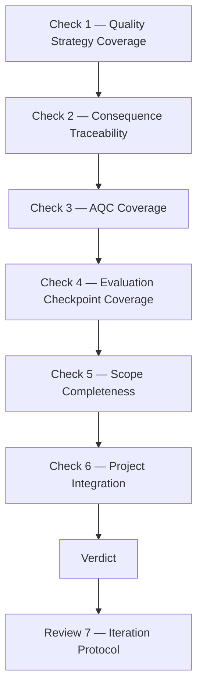
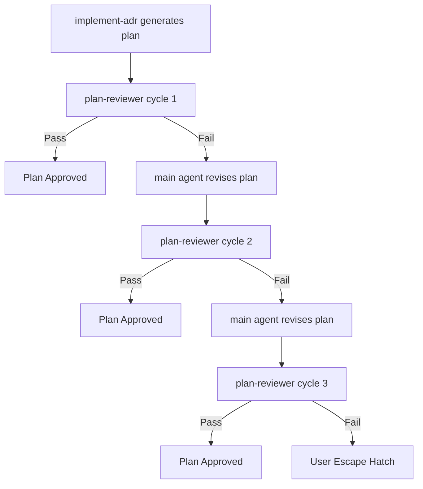

# Plan Review Protocol

Self-contained reference for the plan-reviewer sub-agent. The parent skill reads this file to construct the reviewer prompt after plan creation.

## When to Use

After `implement-adr` generates an implementation plan (Step 3), spawn a general-purpose sub-agent with a structured review prompt derived from this reference. The reviewer reads both the source ADR(s) and the generated plan, then produces a finding report.

The review is mandatory for every plan.

## Procedure

The reviewer runs 6 checks and applies 1 iteration protocol:

**All six checks must be evaluated. If a check is skipped, log the justification inline before proceeding.** Skipping without justification is a workflow violation.

| ID | Description |
|----|-------------|
| Check 1 | Quality Strategy Coverage — verify plan tasks cover each checked ADR quality item |
| Check 2 | Consequence Traceability — verify tasks realize positive consequences, mitigate negative |
| Check 3 | AQC Coverage — verify Additional Quality Concerns are addressed |
| Check 4 | Evaluation Checkpoint Coverage — verify deferred validation needs are in the plan |
| Check 5 | Scope Completeness — verify plan covers the full decision scope |
| Check 6 | Project Integration — verify build/install/test infrastructure is updated |
| Review 7 | Iteration Protocol — cycle limit, revision process, user escape hatch |
| Review 7a | User Escape Hatch — present remaining findings after 3 cycles |



### 1. Quality Strategy Coverage

For each checked `[x]` item in the ADR's Quality Strategy section, verify at least one plan task or acceptance criterion addresses it.

**Cross-reference each checkbox against the Quality Strategy Items documentation** (in the author-adr skill at `assets/templates/nygard-agent-template.md` §Quality Strategy) to understand what each checkbox means and what plan coverage it implies:

| Checkbox | Meaning | Expected Plan Coverage |
|----------|---------|----------------------|
| Introduces major semantic changes | Version bump or migration | Acceptance criteria for version update and downstream compatibility |
| Introduces minor semantic changes | Non-breaking behavioral change | Criteria verifying no unintended side effects |
| Fuzz testing | User input or parsing involved | Fuzz testing criteria on relevant tasks |
| Unit testing | Public surface or new problem class | Unit test criteria on relevant tasks |
| Load testing | Significant system load | Load test criteria on integration tasks |
| Performance testing | Hot path or resource-heavy process | Benchmark criteria on relevant tasks |
| Backwards Compatible | Breaking change risk | Backwards compatibility verification criteria |
| Integration tests | External dependency involved | Integration test criteria |
| Tooling | Build/install/CI affected | Task to update Makefiles, install targets, CI configs |
| User documentation | User-facing changes | Documentation update task or criteria |

Report **PASS** or **FAIL** per item. For FAIL, quote the checkbox and state what plan coverage is missing.

### 2. Consequence Traceability

For each stated **positive** consequence, verify there's a plan task that realizes it. For each stated **negative** consequence, verify there's a mitigation task or an explicit acknowledgment that the risk is accepted.

Report PASS/FAIL per consequence with quoted text.

### 3. AQC Coverage

For each item in the **Additional Quality Concerns** section, verify at least one plan task or acceptance criterion addresses it.

Report PASS/FAIL per item.

### 4. Evaluation Checkpoint Coverage

If the ADR has a populated **Validation needs** section (from the Evaluation Checkpoint), verify each need is addressed in the plan. Pay special attention to items marked as deferred to implementation.

### 5. Scope Completeness

Verify the plan covers the full decision scope:

- Are there decision subsections without corresponding tasks?
- Does the plan cover all skill behaviors described in the Decision section?
- Are all components, interfaces, or artifacts mentioned in the Decision represented in the plan?

### 6. Project Integration

If the plan creates new directories, scripts, skills, or artifacts, verify
the project's build/install/test infrastructure is updated:

- Makefile targets (install, validate, check-refs, test)
- CI/CD pipelines
- README or project documentation
- Any other infrastructure that needs to "know about" new artifacts

## Output Format

The reviewer must produce a structured finding report:

```markdown
## Plan Review Findings

### Quality Strategy Coverage
- [PASS] Backwards Compatible — Task 3.2 verifies no regressions
- [FAIL] User documentation — ADR checks [x] but no plan task updates README

### Consequence Traceability
- [PASS] "Closes the gap between X and Y" — Task 1.1 implements this
- [FAIL] "Each cycle adds ~3 minutes latency" — No mitigation task (accepted?)

### AQC Coverage
- [PASS] False positive rate — Task 3.1 criterion: "≤5%"
- [FAIL] Iteration convergence — No task tests multi-cycle behavior

### Evaluation Checkpoint Coverage
- [PASS/FAIL] Assessment per deferred validation need

### Scope Completeness
- [PASS/FAIL] Section coverage assessment

### Project Integration
- [PASS/FAIL] Infrastructure coverage assessment

### Summary
- Total checks: X
- Pass: Y
- Fail: Z
- Critical gaps: [list]
- Verdict: [Plan Approved / Plan Needs Revision]
```

## Review 7: Iteration Protocol



**Cycle limit: 3.** If the reviewer and planner can't converge in 3 cycles, the remaining findings require human judgment.

### Review 7a: User Escape Hatch

When the 3-cycle limit is reached, present remaining findings to the user:

```markdown
## Plan Review — User Escape Hatch (3 cycles exhausted)

The plan-reviewer found issues that could not be resolved automatically.
Please review each finding and decide how to proceed.

### Remaining Findings

1. **[Category] Item description**
   - Reviewer says: "quoted finding"
   - Planner response: "explanation of why this wasn't addressed"
   - **Your choice:** [ ] Address it  [ ] Reject (rationale: ___)  [ ] Defer

2. **[Category] Item description**
   ...

After marking your choices, the plan will be updated and execution will proceed.
```

The user can:
- **Address** — the agent revises the plan to cover the finding
- **Reject** — the finding is dismissed with a rationale (logged in the plan)
- **Defer** — the finding is acknowledged but not addressed now

## Constructing the Reviewer Prompt

When spawning the sub-agent, construct the prompt from this template:

```
You are a plan reviewer. Your job is to verify that an implementation plan
faithfully reflects the source ADR's stated requirements.

[Insert Review Checklist sections 1-6 from above]

## Source Material

### Source ADR(s)
[Insert full ADR content]

### Generated Plan
[Insert full plan content]

### Quality Strategy Items Reference
[Insert Quality Strategy Items section from author-adr skill: assets/templates/nygard-agent-template.md §Quality Strategy]

## Output Format
[Insert output format specification from above]

Be thorough. Check every checked checkbox, every consequence, every AQC item.
```

The agent reads this reference, constructs the prompt with the actual ADR and plan content, and spawns a `general-purpose` agent with `mode="background"`.
